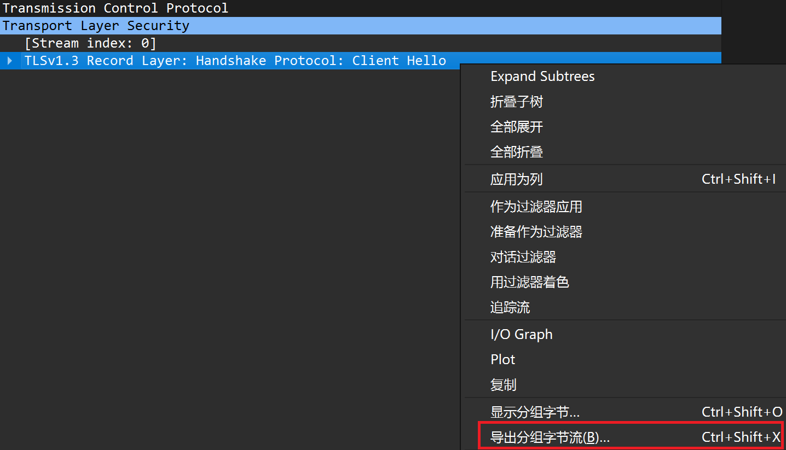

# 重放行为测试

### 1. 流量捕获

使用 `tcpdump` 或 `Wireshark` 捕获数据包用于重放

```shell
# tcpdump -i <网卡名称> host <客户端地址> -w <捕获文件.cap>

# 示例: 捕获 eth0 网卡上来自 127.0.0.1 的流量
tcpdump -i eth0 host 127.0.0.1 -w eth0.cap
```

### 2. 导出数据并停止捕获

测试完成后停止捕获, 使用 `Wireshark` 打开生成的 `.cap` 文件

导出 ClientHello 类型的包, 导出文件名为 `clientHello.bin`, 存放到测试工具目录下



### 3. 编译并运行测试工具

安装 Go 工具链

```shell
# go run . -peer <对端地址>

# 示例: 重放数据包到 1.1.1.1:443 (Cloudflare) 测试行为并对比分析
go run . -peer 1.1.1.1:443
```

### 4. 行为分析与数据统计

根据工具返回值推测对方的服务类型, 堆栈类型
