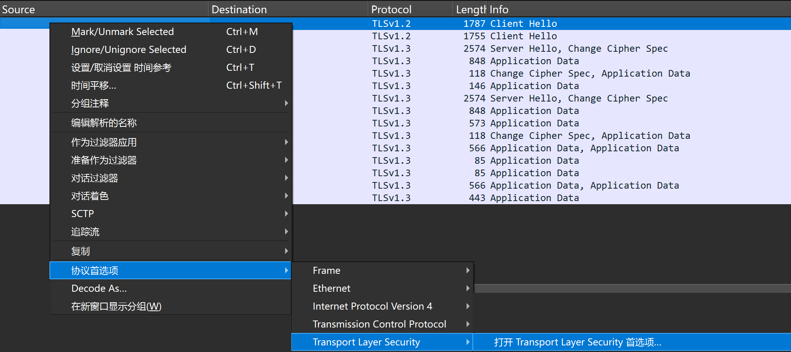
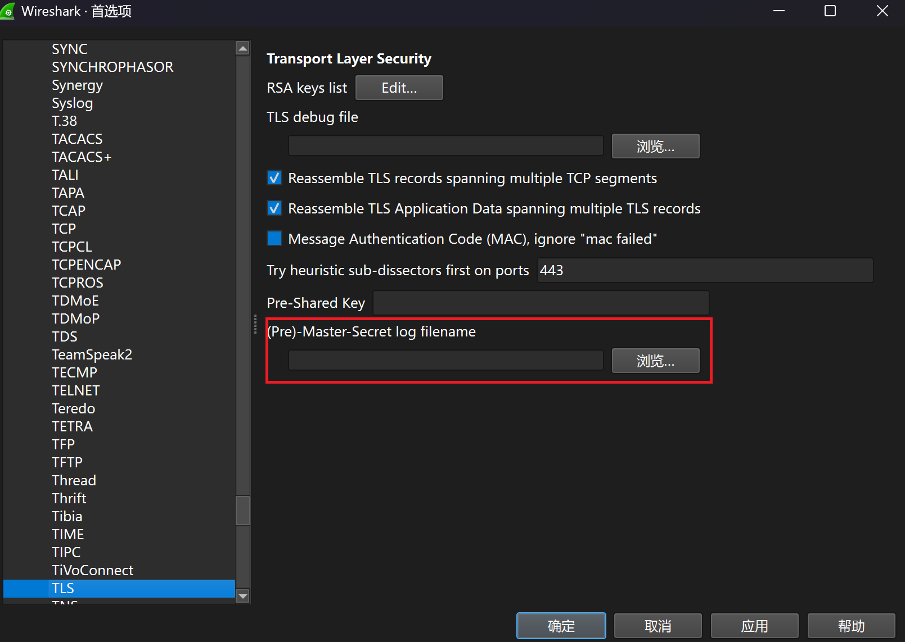

# 服务器行为测试

### 1. 流量捕获

使用 `tcpdump` 或 `Wireshark` 实时捕获数据包

```shell
# tcpdump -i <网卡名称> host <客户端地址> -w <捕获文件.cap>

# 示例: 捕获 eth0 网卡上来自 127.0.0.1 的流量
tcpdump -i eth0 host 127.0.0.1 -w eth0.cap
```

### 2. 编译并运行测试工具

安装 Go 工具链

```shell
# go run . -peer <对端地址>

# 示例: 测试 1.1.1.1:443 (Cloudflare) 的行为
go run . -peer 1.1.1.1:443
```

### 3. 导入捕获数据

测试完成后停止捕获, 使用 `Wireshark` 打开生成的 `.cap` 文件

### 4. 配置 TLS 解密首选项

为了查看加密的内容, 需要设置 Wireshark 解密选项



### 5. 设置密钥日志文件



### 6. 行为分析与数据统计

通过 Wireshark 的过滤功能和统计工具分析以下内容

- 计数器
- 响应数据
- 响应行为
